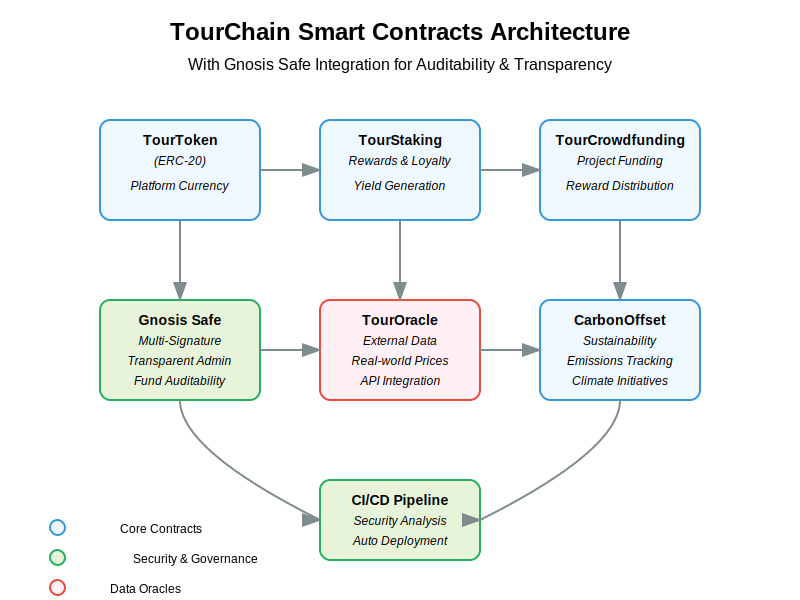

# TourChain Architecture Overview

## System Architecture

TourChain employs a multi-tier architecture that combines blockchain technology, cloud infrastructure, and client applications to create a comprehensive platform for corporate travel management.

```
┌───────────────┐     ┌───────────────┐     ┌───────────────┐
│   Frontend    │     │    Backend    │     │   Blockchain  │
│  Applications │◄────►    Services   │◄────►    Network    │
└───────────────┘     └───────────────┘     └───────────────┘
       │                      │                     │
       │                      │                     │
       ▼                      ▼                     ▼
┌───────────────┐     ┌───────────────┐     ┌───────────────┐
│     User      │     │     Data      │     │  Smart        │
│  Experience   │     │   Storage     │     │  Contracts    │
└───────────────┘     └───────────────┘     └───────────────┘
```

### Component Layers

#### 1. Frontend Layer

The frontend layer provides user interfaces for:
- Corporate administrators
- Travel managers
- Employees/travelers
- Sustainability officers

Built with React and TypeScript, our frontend ensures responsive, accessible interfaces for all users across devices.

#### 2. Backend Services

Our backend services, built on Node.js with Express, handle:
- Authentication and authorization
- API integration with travel providers
- Data processing and analysis
- Blockchain transaction preparation

#### 3. Blockchain Layer

The blockchain layer provides:
- Immutable transaction records
- Smart contract execution
- Tokenized rewards and incentives
- Verifiable carbon offset certificates

### Core Components

#### Smart Contract Infrastructure



TourChain's smart contract infrastructure consists of five primary contracts:

1. **TourToken**: ERC-20 token powering the ecosystem
2. **TourStaking**: Staking mechanism for loyalty and rewards
3. **TourCrowdfunding**: Funding mechanism for sustainable travel initiatives
4. **TourOracle**: Oracle service for real-world data integration
5. **CarbonOffset**: Carbon emissions tracking and offsetting

#### Security Infrastructure

Our security infrastructure includes:

1. **Gnosis Safe Integration**: Multi-signature wallets for all administrative operations
2. **Automated Auditing**: Continuous security scanning with Mythril
3. **Role-Based Access**: Granular access controls for operations
4. **Transaction Monitoring**: Real-time monitoring for suspicious activities

#### Data Flow

```
┌───────────┐    ┌───────────┐    ┌───────────┐    ┌───────────┐
│  Travel   │    │  Backend  │    │ Blockchain│    │   User    │
│  Provider │───►│  Service  │───►│  Network  │───►│ Dashboard │
└───────────┘    └───────────┘    └───────────┘    └───────────┘
                      │                                  ▲
                      │                                  │
                      ▼                                  │
                 ┌───────────┐                     ┌───────────┐
                 │  Oracle   │                     │  Rewards  │
                 │  Service  │────────────────────►│   Engine  │
                 └───────────┘                     └───────────┘
```

### Integration Points

TourChain integrates with:

1. **Travel Management Systems**: Corporate booking tools and expense systems
2. **Sustainability Data Sources**: Carbon emission databases and offset verification systems
3. **Wellness Platforms**: Health and wellbeing tracking services
4. **Financial Systems**: Payment processors and accounting software

### Development Architecture

Our development workflow employs:

1. **Continuous Integration**: Automated testing and validation
2. **Security Analysis**: Code scanning and vulnerability detection
3. **Deployment Automation**: Streamlined release management
4. **Environment Isolation**: Separation of development, testing, and production

## Technical Stack

### Frontend
- React.js with TypeScript
- TailwindCSS with shadcn/ui components
- TanStack Query for data fetching
- Framer Motion for animations

### Backend
- Node.js with Express
- PostgreSQL database
- TypeScript
- Drizzle ORM

### Blockchain
- Solidity smart contracts
- Hardhat development environment
- Ethereum and EVM-compatible networks
- OpenZeppelin contract libraries

### DevOps
- GitHub Actions for CI/CD
- Mythril for security analysis
- Jest for testing
- Solidity Coverage for code coverage

## Design Decisions

### Why Blockchain?

TourChain leverages blockchain technology to provide:

1. **Transparency**: All travel transactions are immutably recorded
2. **Trust**: Multi-signature authorization prevents unauthorized spending
3. **Tokenization**: Reward mechanisms that incentivize sustainable choices
4. **Auditability**: Complete history of all administrative actions

### Why Multi-Contract Architecture?

Our multi-contract approach provides:

1. **Modularity**: Contracts can be upgraded independently
2. **Security**: Isolation of concerns prevents cascading vulnerabilities
3. **Specialization**: Each contract performs a specific function optimally
4. **Scalability**: Contracts can be optimized for their specific use cases

### Why Gnosis Safe?

Gnosis Safe provides:

1. **Multi-signature Security**: Requires multiple approvals for critical actions
2. **Transparent Administration**: All proposed transactions are visible
3. **Delegated Execution**: Gas-efficient operations
4. **Proven Security**: Battle-tested in production environments

## Future Architecture Considerations

1. **Layer 2 Integration**: Scaling with zkSync, Optimism, or Arbitrum
2. **Cross-Chain Functionality**: Interoperability with multiple blockchain networks
3. **Decentralized Identity**: Integration with DIDs for privacy-preserving user management
4. **DAO Governance**: Transition to community-driven decision making