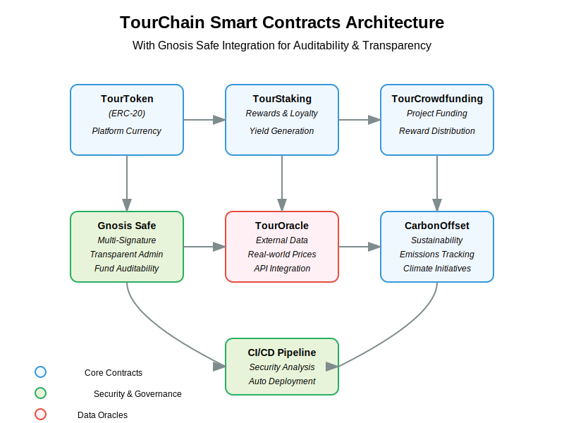

# Arquitetura de Smart Contracts do TourChain

Este documento descreve a arquitetura e funcionalidades dos smart contracts que compõem o backbone da plataforma TourChain.

## Visão Geral da Arquitetura

O TourChain é baseado em uma arquitetura de contratos modulares que trabalham em conjunto para fornecer funcionalidades completas para gerenciamento de viagens corporativas, recompensas, financiamento e sustentabilidade.

## Contratos Principais

### 1. TourToken (TOUR)

**Função**: Token utilitário e de governança da plataforma.

**Principais características**:
- Token ERC20 padrão
- Fornecimento máximo limitado a 100 milhões de tokens
- Governança baseada em roles (MINTER_ROLE, GOVERNANCE_ROLE)
- Mecanismos de queima para controle de inflação

**Interações**:
- Utilizado por TourStaking para distribuição de recompensas
- Utilizado por TourCrowdfunding como meio de pagamento
- Utilizado por CarbonOffset para pagamentos de compensação de carbono

### 2. TourStaking

**Função**: Sistema de staking que incentiva a participação na plataforma.

**Principais características**:
- Staking de tokens TOUR com recompensas
- Período mínimo de staking configurável
- Taxa de retirada antecipada
- Distribuição proporcional de recompensas baseada no valor e tempo de staking

**Interações**:
- Depende do TourToken para staking e recompensas
- Fornece incentivos para usuários corporativos e viajantes

### 3. TourCrowdfunding

**Função**: Plataforma de financiamento coletivo para projetos de turismo sustentável e inovação.

**Principais características**:
- Criação de campanhas com metas de financiamento
- Sistema de níveis de recompensa personalizáveis
- Mecanismo de pledges com recompensas em tokens
- Taxas de plataforma configuráveis
- Reembolsos automáticos em caso de falha da campanha

**Interações**:
- Utiliza TourToken como meio de pagamento
- Pode usar TourOracle para informações externas

### 4. TourOracle

**Função**: Oracle para integração de dados externos como emissões de carbono e otimização de viagens.

**Principais características**:
- Sistema de oracles com staking como garantia
- Múltiplas fontes de dados podem atuar como oracles
- Armazenamento de dados sobre emissões de carbono de viagens
- Dados de otimização de rotas e custos
- Preços de moedas para conversões

**Interações**:
- Fornece dados para CarbonOffset
- Pode ser consultado por outros contratos para informações externas

### 5. CarbonOffset

**Função**: Sistema para rastreamento e compensação de emissões de carbono de viagens.

**Principais características**:
- Projetos de compensação de carbono com preços e capacidades variáveis
- Cálculo de emissões de carbono baseado em dados de viagens
- Rastreamento de compensações e verificação
- Integração com organizações de compensação de carbono
- Certificados de compensação de carbono

**Interações**:
- Utiliza TourToken para pagamentos
- Consome dados de TourOracle para emissões de carbono

## Relações e Fluxos

### Fluxo de Tokenomics

1. Tokens TOUR são distribuídos inicialmente para stakeholders
2. Usuários podem fazer stake de tokens para ganhar recompensas
3. Empresas usam tokens para compensar emissões de carbono
4. Apoiadores usam tokens para financiar projetos sustentáveis
5. Criadores de projetos ganham tokens através de campanhas bem-sucedidas

### Fluxo de Sustentabilidade

1. TourOracle registra dados de emissões de carbono de viagens
2. CarbonOffset calcula o custo de compensação baseado nos projetos disponíveis
3. Empresas pagam em tokens TOUR para compensar suas emissões
4. O sistema rastreia e verifica as compensações
5. Certificados de compensação são emitidos para as empresas

### Fluxo de Crowdfunding

1. Criadores propõem campanhas de turismo sustentável
2. Definição de níveis de recompensa com valores e benefícios
3. Apoiadores contribuem com tokens TOUR para as campanhas
4. O sistema automaticamente gerencia o ciclo de vida da campanha
5. Se bem-sucedida, os fundos são liberados para o criador
6. Se falhar, os apoiadores recebem reembolsos automáticos

## Camadas de Segurança

### Controle de Acesso

Todos os contratos implementam um sistema de controle de acesso baseado em roles:

- **ADMIN_ROLE**: Configurações gerais e manutenção
- **MINTER_ROLE**: Criação de novos tokens
- **GOVERNANCE_ROLE**: Decisões de governança
- **PROJECT_ADMIN_ROLE**: Gerenciamento de projetos de crowdfunding
- **ORACLE_ROLE**: Fornecimento de dados externos
- **VERIFIER_ROLE**: Verificação de compensações de carbono

### Segurança de Fundos

- Mecanismos de escrow para crowdfunding
- Distribuição automática de recompensas
- Sistema de taxas transparente
- Limites de retirada e proteções contra ataques

## Governança e Atualizações

O sistema é projetado para ser governado pela comunidade através de:

1. **Votação direta**: Holders de tokens TOUR podem votar em propostas
2. **Propostas de melhoria**: Membros com GOVERNANCE_ROLE podem propor mudanças
3. **Upgrades de contratos**: Implementação de novos recursos através de upgrades

## Considerações Técnicas

### Conformidade com Padrões

- Contratos baseados em padrões OpenZeppelin
- Implementação ERC20 para o token TOUR
- Padrão de roles para controle de acesso

### Otimização de Gas

- Armazenamento de dados otimizado
- Operações em lote quando possível
- Minimização de operações custosas

### Testabilidade

- Cobertura de teste de 100% para todos os contratos
- Testes de integração para fluxos completos
- Simulações de casos extremos

## Resumo de Implementação

| Contrato | Arquivo | Descrição |
|----------|---------|-----------|
| TourToken | `contracts/tokens/TourToken.sol` | Implementação do token ERC20 da plataforma |
| TourStaking | `contracts/tokens/TourStaking.sol` | Sistema de staking e recompensas |
| TourCrowdfunding | `contracts/crowdfunding/TourCrowdfunding.sol` | Plataforma de financiamento coletivo |
| TourOracle | `contracts/oracles/TourOracle.sol` | Oracle para dados externos |
| CarbonOffset | `contracts/sustainability/CarbonOffset.sol` | Sistema de compensação de carbono |

## Próximos Passos de Desenvolvimento

- Implementação de votação direta e governança descentralizada
- Integração com mais provedores de dados de emissões de carbono
- Desenvolvimento de NFTs para certificados de compensação de carbono
- Mecanismos avançados de liquidez para o token TOUR